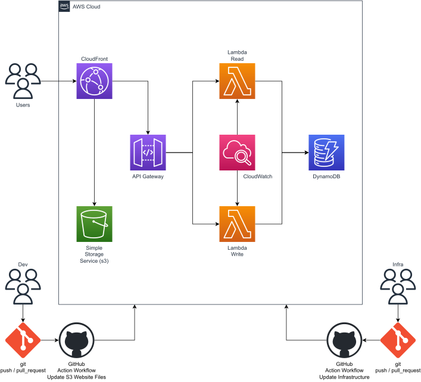

# AWS Static Website S3 - CloudFront

The goal of this repository is to automate the process of adding the website files placed on an AWS Simple Storage Service (S3) Bucket through a GitHub action workflow.

## Architecture

The system's architecture is implemented on [AWS Cloud](https://aws.amazon.com/?nc1=h_ls) and consists of the following resources:

* 2 AWS Lambdas
* 2 CloudWatch Log groups
* 1 DynamoDB
* 1 API Gateway 
* 1 S3 Bucket
* 1 CloudFront Distribution

<div align=Center>
    
</div>

## Pipeline to Add Files to S3 bucket

The GitHub Actions workflow shown below is used to add file to the S3 bucket:

<div>
    
</div>

A GitHub context-based condition has been implemented to select which s3 bucket to select, i.e. those in production or those in development. This is achieved through the following [workflow](.github/workflows/s3.yml):

```

```
