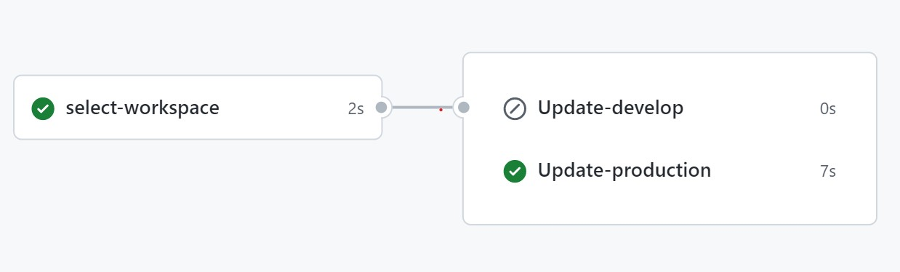

# AWS Static Website S3 - CloudFront

The goal of this repository is to automate the process of adding the website files placed on an AWS Simple Storage Service (S3) Bucket through a GitHub action workflow.

## Architecture

The system's architecture is implemented on [AWS Cloud](https://aws.amazon.com/?nc1=h_ls) and consists of the following resources:

* 2 AWS Lambdas
* 2 CloudWatch Log groups
* 1 DynamoDB
* 1 API Gateway 
* 1 S3 Bucket
* 1 CloudFront Distribution

<div align=Center>
    
</div>

## Pipeline to Add Files to S3 bucket

The GitHub Actions workflow shown below is used to add file to the S3 bucket:

<div>
    
</div>

A GitHub context-based condition has been implemented to select which s3 bucket to select, i.e. those in production or those in development. This is achieved through the following [workflow](.github/workflows/s3.yml):

```
name: Add files to AWS s3

run-name: ${{ github.actor }} is updating files to AWS s3 🚀

on:
  pull_request:
    types:
      - closed
    branches:
      - develop
      - main
  push:
    branches:
      - develop

env:
  AWS_REGION: us-east-1
  TABLE_NAME: books
  PROD_URL: https://p58ybvz7v5.execute-api.us-east-1.amazonaws.com

jobs:

  select-workspace:
    
    runs-on: ubuntu-latest
    outputs:
      workspace:  ${{ steps.set-workspace.outputs.workspace }}
    
    steps:

      - name: Set workspace
        id: set-workspace
        run: |
          if [[ $GITHUB_EVENT_NAME == "pull_request" ]]; then
            echo "workspace=$GITHUB_BASE_REF" >> $GITHUB_OUTPUT
          else
            echo "workspace=$GITHUB_REF_NAME" >> $GITHUB_OUTPUT
          fi

  Update-develop:
    
    needs: select-workspace
    if: needs.select-workspace.outputs.workspace == 'develop'

    runs-on: ubuntu-latest
    env:
      WORKSPACE: ${{ needs.select-workspace.outputs.workspace }}
      S3_ID: 7807016451756110004 # Develop S3 id
      DEV_URL: https://c9dlxhvnce.execute-api.us-east-1.amazonaws.com/develop

    
    steps:

      - name: Checkout
        uses: actions/checkout@v3

      - name: Install aws
        uses: aws-actions/configure-aws-credentials@v1-node16
        with:
          aws-access-key-id: ${{ secrets.AWS_ACCESS_KEY_ID }}
          aws-secret-access-key: ${{ secrets.AWS_SECRET_ACCESS_KEY }}
          aws-region: ${{ env.AWS_REGION }}

      - name: Adequate files
        run: |
          sed -i "s|$PROD_URL/$TABLE_NAME|$DEV_URL/$TABLE_NAME-$WORKSPACE|g" website/create/app.js
          sed -i "s|$PROD_URL/$TABLE_NAME|$DEV_URL/$TABLE_NAME-$WORKSPACE|g" website/read/app.js
          sed -i "s|$PROD_URL/$TABLE_NAME|$DEV_URL/$TABLE_NAME-$WORKSPACE|g" website/update/app.js
          sed -i "s|$PROD_URL/$TABLE_NAME|$DEV_URL/$TABLE_NAME-$WORKSPACE|g" website/delete/app.js

      - name: Sync s3 files
        run: cd website && aws s3 sync . "s3://website-bucket-$AWS_REGION-$WORKSPACE-$S3_ID"

  Update-production:
    
    needs: select-workspace
    if: needs.select-workspace.outputs.workspace == 'main'

    runs-on: ubuntu-latest
    env:
      WORKSPACE: ${{ needs.select-workspace.outputs.workspace }}
      S3_ID: 14800714847457006855 # production S3 id
    
    steps:

      - name: Checkout
        uses: actions/checkout@v3

      - name: Install aws
        uses: aws-actions/configure-aws-credentials@v1-node16
        with:
          aws-access-key-id: ${{ secrets.AWS_ACCESS_KEY_ID }}
          aws-secret-access-key: ${{ secrets.AWS_SECRET_ACCESS_KEY }}
          aws-region: ${{ env.AWS_REGION }}

      - name: Sync s3 files
        run: cd website && aws s3 sync . "s3://website-bucket-$AWS_REGION-$WORKSPACE-$S3_ID"
```
